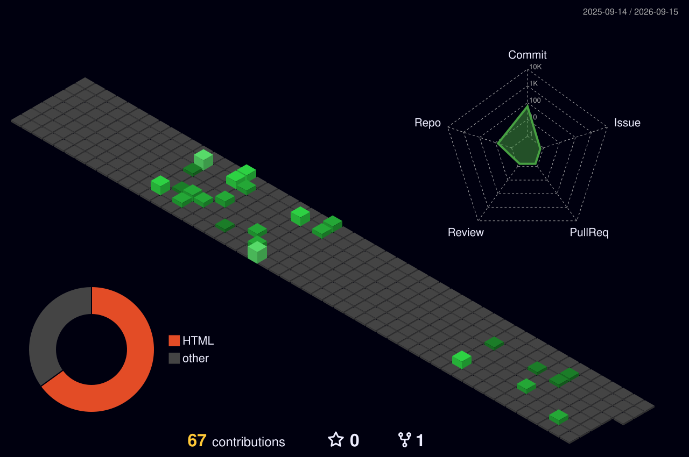

<!-- ===================== TERMINAL HEADER ===================== -->


<!-- ===================== BOOT / TYPING ===================== -->
<p align="center">
  
</p>

<br/>

<!-- ===================== NEOFETCH CARD ===================== -->
```console
aakash@github ~ $ neofetch
                                     ┌──────────────────────────────────────────────┐
         __ _  __ _ _ __             │  aakash@github                               │
       / _` |/ _` | '_ \            │  ────────────────────────────────────────    │
      | (_| | (_| | | | |           │  OS.......... Frontend Engineer (prod-grade) │
       \__,_|\__,_|_| |_|           │  Host........ Next.js + TypeScript Arch      │
                                     │  Kernel...... React 19 / App Router          │
      ╔══════════════════╗          │  Uptime...... building UI systems, 24/7      │
      ║  > building UI   ║          │  Shell....... zsh + vim motions              │
      ║  > pixel perfect ║          │  DE.......... TailwindCSS + ShadCN UI         │
      ║  > 60fps always  ║          │  WM.......... reusable component design       │
      ╚══════════════════╝          │  Terminal.... performance-obsessed           │
                                     │  Email....... rawalakash37@gmail.com          │
                                     └──────────────────────────────────────────────┘
```

<!-- ===================== ABOUT (ls) ===================== -->
```console
aakash@github ~ $ cat about.md

  # 🎨  I design & build Production-Grade UI Systems
  # ⚡  Specialized in Next.js + TypeScript Architecture
  # 🧩  Expert in Reusable Component Design
  # 📊  Strong in Complex Dashboard UI & Data Tables
  # 🚀  Obsessed with Performance & Clean Code
```

<!-- ===================== STACK (which) ===================== -->
```console
aakash@github ~ $ which --stack --core
```
<p align="center">
  
</p>
<p align="center">
  
  
  
  
</p>

```console
aakash@github ~ $ which --stack --extras
```
<p align="center">
  
</p>

<!-- ===================== WHAT I BUILD (tree) ===================== -->
```console
aakash@github ~ $ tree ./projects

./projects
├── 📊 complex-admin-dashboards
├── 💬 whatsapp-style-chat-interfaces
├── 🔧 workflow-builder-uis
├── 📝 dynamic-form-systems
├── ⚡ real-time-ui-systems
└── 📱 mobile-responsive-interfaces

6 directories, all production-grade.
```

<!-- ===================== 3D CONTRIB ===================== -->
```console
aakash@github ~ $ git log --graph --3d --all
```
<p align="center">
  
</p>

<!-- ===================== STATS ===================== -->
```console
aakash@github ~ $ gh stats --username iAakashRawal

<!-- ===================== ACTIVITY ===================== -->
```console
aakash@github ~ $ htop --contributions

<!-- ===================== SNAKE ===================== -->
<p align="center">
  
</p>

<!-- ===================== CONNECT (ping) ===================== -->
```console
aakash@github ~ $ ping --connect
```
<p align="center">
  <a href="https://www.linkedin.com/in/aakash-rawal-928369244" target="_blank">
    
  </a>
  <a href="https://github.com/iAakashRawal" target="_blank">
    
  </a>
  <a href="mailto:rawalakash37@gmail.com">
    
  </a>
</p>

<!-- ===================== EXIT ===================== -->
```console
aakash@github ~ $ exit
Connection to github closed.  //  crafting clean, scalable & high-performance UI ✨
```

<p align="center">
  
</p>
