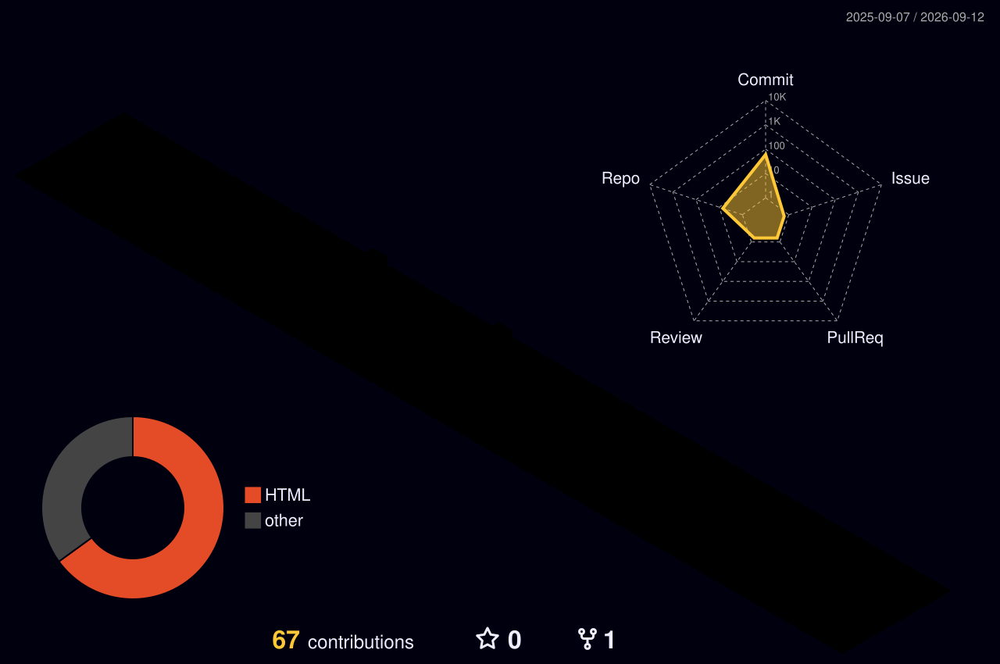

<!-- ======================= 3D BANNER ======================= -->
<a href="#">
  
</a>

<!-- ======================= TYPING SVG ======================= -->
<p align="center">
  
</p>

<!-- ======================= PROFILE VISITS + FOLLOW ======================= -->
<p align="center">
  
  <a href="https://github.com/iAakashRawal?tab=followers">
    
  </a>
</p>

<br/>

<!-- ======================= ABOUT ======================= -->


## 🧠 &nbsp;About Me

```ts
const aakash = {
  role: "Frontend Engineer",
  focus: ["Production-Grade UI Systems", "Next.js Architecture"],
  strengths: ["Reusable Components", "Complex Dashboards", "Data Tables"],
  mindset: "Performance + Clean Code",
  contact: "rawalakash37@gmail.com",
};
```

- 🎨 &nbsp;I design and build **Production-Grade UI Systems**
- ⚡ &nbsp;Specialized in **Next.js + TypeScript Architecture**
- 🧩 &nbsp;Expert in **Reusable Component Design**
- 📊 &nbsp;Strong in **Complex Dashboard UI & Data Tables**
- 🚀 &nbsp;Obsessed with **Performance & Clean Code**

<br clear="right"/>

<!-- ======================= DIVIDER ======================= -->


<!-- ======================= CORE STACK ======================= -->
<h2 align="center">🛠️ &nbsp;Frontend Stack — Core Strength</h2>

<p align="center">
  
</p>
<p align="center">
  
  
  
  
</p>

<h3 align="center">⚙️ &nbsp;Also Working With</h3>
<p align="center">
  
</p>


<!-- ======================= WHAT I BUILD ======================= -->
<h2 align="center">🧩 &nbsp;What I Build</h2>

<table align="center">
  <tr>
    <td>✔️ Complex Admin Dashboards</td>
    <td>✔️ WhatsApp-Style Chat Interfaces</td>
    <td>✔️ Workflow Builder UIs</td>
  </tr>
  <tr>
    <td>✔️ Dynamic Form Systems</td>
    <td>✔️ Real-Time UI Systems</td>
    <td>✔️ Mobile Responsive Interfaces</td>
  </tr>
</table>


<!-- ======================= 3D CONTRIBUTION GRAPH ======================= -->
<h2 align="center">🧊 &nbsp;My 3D Contribution Galaxy</h2>

<p align="center">
  
</p>

<!-- ======================= GITHUB STATS ======================= -->
<h2 align="center">📊 &nbsp;GitHub Analytics</h2>

<p align="center">
  
  
</p>

<p align="center">
  
</p>

<p align="center">
  
</p>

<!-- ======================= ACTIVITY GRAPH ======================= -->
<p align="center">
  
</p>

<!-- ======================= SNAKE ======================= -->
<p align="center">
  
</p>


<!-- ======================= CONNECT ======================= -->
<h2 align="center">🌐 &nbsp;Connect With Me</h2>

<p align="center">
  <a href="https://www.linkedin.com/in/aakash-rawal-928369244" target="_blank">
    
  </a>
  <a href="https://github.com/iAakashRawal" target="_blank">
    
  </a>
  <a href="mailto:rawalakash37@gmail.com">
    
  </a>
</p>

<!-- ======================= 3D FOOTER ======================= -->

